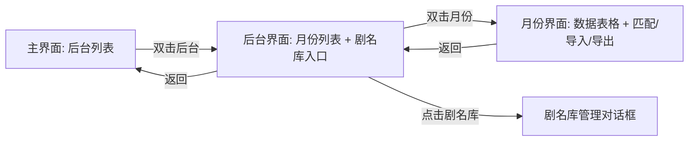

# 设计文档

## 概述

剧名数据管理系统是一个基于 Python + tkinter + SQLite 的桌面应用。系统采用分层架构：数据层（SQLite + DAO）、业务逻辑层（匹配引擎、导入导出）、表现层（tkinter GUI）。用户通过多级导航界面管理后台、剧名库、月份数据空间，并执行数据导入、匹配、统计和导出操作。

## 架构

```
┌─────────────────────────────────────────────┐
│                 表现层 (GUI)                  │
│  MainWindow → BackendView → MonthView       │
│  DramaLibraryDialog                         │
├─────────────────────────────────────────────┤
│               业务逻辑层                      │
│  MatchEngine  │  ExcelImporter  │  Exporter │
├─────────────────────────────────────────────┤
│                数据层 (DAO)                   │
│  Database  │  BackendDAO  │  DramaDAO       │
│  MonthDAO  │  ImportedDataDAO               │
├─────────────────────────────────────────────┤
│              SQLite 数据库文件                 │
└─────────────────────────────────────────────┘
```

### 导航流程



## 组件与接口

### 1. 数据层

#### Database（数据库管理器）

```python
class Database:
    def __init__(self, db_path: str = "drama_manager.db"):
        """初始化数据库连接，创建所有表"""
    
    def get_connection(self) -> sqlite3.Connection:
        """获取数据库连接"""
    
    def close(self):
        """关闭数据库连接"""
```

#### BackendDAO（后台数据访问）

```python
class BackendDAO:
    def __init__(self, db: Database): ...
    
    def create(self, name: str) -> int:
        """创建后台，返回 ID"""
    
    def delete(self, backend_id: int) -> None:
        """删除后台及其所有关联数据（级联删除）"""
    
    def list_all(self) -> list[tuple[int, str]]:
        """返回所有后台 [(id, name), ...]"""
```

#### DramaDAO（剧名库数据访问）

```python
class DramaDAO:
    def __init__(self, db: Database): ...
    
    def add(self, backend_id: int, name: str) -> bool:
        """添加剧名，重复返回 False"""
    
    def add_batch(self, backend_id: int, names: list[str]) -> int:
        """批量添加，返回实际新增数量"""
    
    def delete(self, backend_id: int, name: str) -> None:
        """删除指定剧名"""
    
    def list_all(self, backend_id: int) -> list[str]:
        """返回该后台所有剧名"""
    
    def get_set(self, backend_id: int) -> set[str]:
        """返回该后台剧名集合（用于匹配）"""
```

#### MonthDAO（月份数据访问）

```python
class MonthDAO:
    def __init__(self, db: Database): ...
    
    def create(self, backend_id: int, label: str) -> int:
        """创建月份空间，返回 ID。重复则抛出 ValueError"""
    
    def delete(self, month_id: int) -> None:
        """删除月份及其所有数据（级联删除）"""
    
    def list_all(self, backend_id: int) -> list[tuple[int, str]]:
        """返回该后台所有月份 [(id, label), ...]"""
```

#### ImportedDataDAO（导入数据访问）

```python
class ImportedDataDAO:
    def __init__(self, db: Database): ...
    
    def save_data(self, month_id: int, headers: list[str], rows: list[list]) -> None:
        """保存导入数据（先清除旧数据再写入）"""
    
    def get_headers(self, month_id: int) -> list[str]:
        """获取表头"""
    
    def get_all_rows(self, month_id: int) -> list[list]:
        """获取所有行数据"""
    
    def save_match_results(self, month_id: int, matched_indices: list[int]) -> None:
        """保存匹配结果（行索引列表）"""
    
    def get_match_results(self, month_id: int) -> list[int]:
        """获取匹配结果行索引列表"""
    
    def has_data(self, month_id: int) -> bool:
        """检查月份是否有导入数据"""
```

### 2. 业务逻辑层

#### MatchEngine（匹配引擎）

```python
class MatchEngine:
    @staticmethod
    def match(rows: list[list], col_index: int, drama_set: set[str]) -> list[int]:
        """
        对导入数据执行匹配，返回匹配行的索引列表（0-based）。
        比对时去除首尾空格后精确匹配。
        """
    
    @staticmethod
    def find_column_index(headers: list[str], target: str = "合集名称") -> int:
        """在表头中查找目标列，返回索引。未找到抛出 ValueError"""
```

#### ExcelImporter（Excel 导入器）

```python
class ExcelImporter:
    @staticmethod
    def import_file(file_path: str) -> tuple[list[str], list[list]]:
        """
        读取 Excel 文件，返回 (headers, rows)。
        headers: 表头列名列表
        rows: 每行数据列表的列表
        """
    
    @staticmethod
    def import_drama_names(file_path: str, column_id: str = None) -> list[str]:
        """
        从 Excel 或文本文件导入剧名列表。
        文本文件按行读取，Excel 文件读取指定列或第一列。
        """
```

#### Exporter（数据导出器）

```python
class Exporter:
    @staticmethod
    def export_to_excel(file_path: str, headers: list[str], rows: list[list]) -> None:
        """将数据导出为 Excel 文件"""
```

### 3. 表现层

#### MainWindow（主窗口 - 后台列表）

```python
class MainWindow:
    """应用主窗口，显示后台列表，提供新建/删除后台功能"""
    def __init__(self, root: tk.Tk, db: Database): ...
```

- 显示后台列表（Listbox）
- "新建后台"按钮：弹出输入对话框
- "删除后台"按钮：确认后删除
- 双击后台进入 BackendView

#### BackendView（后台界面 - 月份列表）

```python
class BackendView:
    """后台管理界面，显示月份列表和剧名库入口"""
    def __init__(self, parent, db: Database, backend_id: int, backend_name: str): ...
```

- 显示月份列表（Listbox）
- "新建月份"按钮：年份+月份选择
- "删除月份"按钮
- "管理剧名库"按钮：打开 DramaLibraryDialog
- "返回"按钮
- 双击月份进入 MonthView

#### MonthView（月份界面 - 数据表格）

```python
class MonthView:
    """月份数据界面，显示数据表格，提供导入/匹配/导出功能"""
    def __init__(self, parent, db: Database, backend_id: int, month_id: int, month_label: str): ...
```

- 数据表格（ttk.Treeview）
- 工具栏按钮：导入、匹配、重新匹配、导出
- 视图切换：全部 / 仅匹配 / 仅未匹配（RadioButton）
- 底部统计栏：合计行 + 匹配统计
- "返回"按钮

#### DramaLibraryDialog（剧名库管理对话框）

```python
class DramaLibraryDialog:
    """剧名库管理弹窗，支持添加/删除/批量导入"""
    def __init__(self, parent, db: Database, backend_id: int): ...
```

- 剧名列表（Listbox + Scrollbar）
- 输入框 + "添加"按钮
- "删除"按钮
- "批量导入"按钮

## 数据模型

### SQLite 表结构

```sql
-- 后台表
CREATE TABLE IF NOT EXISTS backends (
    id INTEGER PRIMARY KEY AUTOINCREMENT,
    name TEXT NOT NULL UNIQUE
);

-- 剧名库表
CREATE TABLE IF NOT EXISTS drama_names (
    id INTEGER PRIMARY KEY AUTOINCREMENT,
    backend_id INTEGER NOT NULL,
    name TEXT NOT NULL,
    FOREIGN KEY (backend_id) REFERENCES backends(id) ON DELETE CASCADE,
    UNIQUE(backend_id, name)
);

-- 月份表
CREATE TABLE IF NOT EXISTS months (
    id INTEGER PRIMARY KEY AUTOINCREMENT,
    backend_id INTEGER NOT NULL,
    label TEXT NOT NULL,
    FOREIGN KEY (backend_id) REFERENCES backends(id) ON DELETE CASCADE,
    UNIQUE(backend_id, label)
);

-- 导入数据表头
CREATE TABLE IF NOT EXISTS imported_headers (
    id INTEGER PRIMARY KEY AUTOINCREMENT,
    month_id INTEGER NOT NULL UNIQUE,
    headers_json TEXT NOT NULL,
    FOREIGN KEY (month_id) REFERENCES months(id) ON DELETE CASCADE
);

-- 导入数据行
CREATE TABLE IF NOT EXISTS imported_rows (
    id INTEGER PRIMARY KEY AUTOINCREMENT,
    month_id INTEGER NOT NULL,
    row_index INTEGER NOT NULL,
    row_json TEXT NOT NULL,
    FOREIGN KEY (month_id) REFERENCES months(id) ON DELETE CASCADE
);

-- 匹配结果
CREATE TABLE IF NOT EXISTS match_results (
    id INTEGER PRIMARY KEY AUTOINCREMENT,
    month_id INTEGER NOT NULL UNIQUE,
    matched_indices_json TEXT NOT NULL,
    FOREIGN KEY (month_id) REFERENCES months(id) ON DELETE CASCADE
);
```

### 数据存储策略

- 表头和行数据使用 JSON 序列化存储，保持灵活性（不同 Excel 列数不同）
- 匹配结果存储为匹配行索引的 JSON 数组
- 所有外键启用 `ON DELETE CASCADE`，删除后台时自动清理关联数据
- 数据库文件 `drama_manager.db` 存储在应用程序同级目录


## 正确性属性

*属性是指在系统所有有效执行中都应成立的特征或行为——本质上是关于系统应该做什么的形式化陈述。属性是人类可读规范与机器可验证正确性保证之间的桥梁。*

### Property 1: 后台 CRUD 不变量

*For any* 后台名称，创建后台后该名称应出现在后台列表中；删除后台后该名称应从列表中消失，且其关联的剧名库和月份数据也应被清除。

**Validates: Requirements 1.1, 1.2**

### Property 2: 剧名库添加不变量

*For any* 后台和任意剧名列表（包括单个和批量），添加后所有唯一剧名应出现在剧名库中；重复添加同一剧名不应增加剧名库的大小。

**Validates: Requirements 2.2, 2.3, 2.4, 2.6**

### Property 3: 数据持久化往返

*For any* 后台、剧名库、月份和导入数据，保存到 SQLite 后关闭连接再重新打开，查询到的数据应与保存前等价。

**Validates: Requirements 2.5, 4.3, 5.3, 9.2**

### Property 4: 匹配正确性

*For any* 导入数据行集合和剧名集合，匹配引擎返回的匹配行索引应恰好等于那些目标列值（去除首尾空格后）存在于剧名集合中的行索引。

**Validates: Requirements 5.1, 5.4, 5.5**

### Property 5: 视图筛选分区

*For any* 数据集和匹配结果，"全部数据"视图应返回所有行，"仅匹配"视图应返回恰好匹配的行，"仅未匹配"视图应返回恰好未匹配的行；且匹配行与未匹配行的并集等于全部行，交集为空。

**Validates: Requirements 6.1, 6.2, 6.3, 6.4**

### Property 6: 列合计正确性

*For any* 数据行集合，合计函数应对数值列正确求和，对非数值列返回空或忽略。

**Validates: Requirements 7.1, 7.2, 7.3**

### Property 7: 导入数据往返

*For any* 表头和行数据，通过 ImportedDataDAO 保存后再查询，应返回等价的表头和行数据。

**Validates: Requirements 4.1, 4.3**

### Property 8: 导出往返

*For any* 表头和行数据，导出为 Excel 文件后再导入，应产生等价的数据。

**Validates: Requirements 8.1**

### Property 9: 重新导入替换

*For any* 已有数据的月份，重新导入新数据后，查询应仅返回新数据，旧数据应完全消失。

**Validates: Requirements 4.5**

## 错误处理

| 场景 | 处理方式 |
|------|---------|
| Excel 文件格式无效或无法读取 | 捕获异常，弹出 messagebox 显示错误信息 |
| 导入数据中不存在"合集名称"列 | 弹出列选择对话框，让用户手动选择匹配列 |
| 尝试创建重复的后台名称 | SQLite UNIQUE 约束捕获，提示用户名称已存在 |
| 尝试创建重复的月份 | SQLite UNIQUE 约束捕获，提示用户月份已存在 |
| 添加重复剧名 | 忽略重复项（INSERT OR IGNORE），提示用户 |
| 导出文件写入失败 | 捕获 IOError/PermissionError，提示用户检查文件路径和权限 |
| 数据库连接失败 | 应用启动时捕获异常，显示错误并退出 |
| 删除后台/月份时的级联删除 | 通过 SQLite ON DELETE CASCADE 自动处理 |

## 测试策略

### 测试框架

- **单元测试**: pytest
- **属性测试**: hypothesis（Python 属性测试库）
- **测试数据**: 使用 hypothesis 的 strategies 生成随机数据

### 单元测试

单元测试覆盖具体示例和边界情况：

- DAO 层：CRUD 操作的基本功能验证
- MatchEngine：具体匹配场景（空数据、全匹配、无匹配）
- ExcelImporter：有效/无效文件处理
- Exporter：基本导出功能
- 列查找：表头存在/不存在目标列

### 属性测试

属性测试使用 hypothesis 库，每个属性测试至少运行 100 次迭代。

每个属性测试必须用注释标注对应的设计属性：

```python
# Feature: drama-data-manager, Property 4: 匹配正确性
@given(...)
def test_match_correctness(...):
    ...
```

属性测试覆盖：

1. **Property 1**: 后台 CRUD 不变量 — 生成随机后台名称序列，验证创建/删除后列表状态正确
2. **Property 2**: 剧名库添加不变量 — 生成随机剧名列表，验证添加后唯一性和幂等性
3. **Property 3**: 数据持久化往返 — 生成随机数据，保存后重新连接验证数据完整
4. **Property 4**: 匹配正确性 — 生成随机行数据和剧名集合，验证匹配结果精确
5. **Property 5**: 视图筛选分区 — 生成随机数据和匹配索引，验证三个视图的分区正确性
6. **Property 6**: 列合计正确性 — 生成混合数值/非数值列数据，验证求和正确
7. **Property 7**: 导入数据往返 — 生成随机表头和行，验证 DAO 保存/读取往返
8. **Property 8**: 导出往返 — 生成随机数据，导出后重新导入验证等价
9. **Property 9**: 重新导入替换 — 生成两批数据，验证第二次导入完全替换第一次

### 测试组织

```
tests/
├── test_backend_dao.py      # 后台 DAO 单元测试 + Property 1
├── test_drama_dao.py        # 剧名库 DAO 单元测试 + Property 2
├── test_imported_data_dao.py # 导入数据 DAO 单元测试 + Property 7, 9
├── test_match_engine.py     # 匹配引擎单元测试 + Property 4
├── test_view_filter.py      # 视图筛选单元测试 + Property 5
├── test_statistics.py       # 统计函数单元测试 + Property 6
├── test_persistence.py      # 持久化往返测试 + Property 3
├── test_excel_io.py         # Excel 导入导出测试 + Property 8
```
