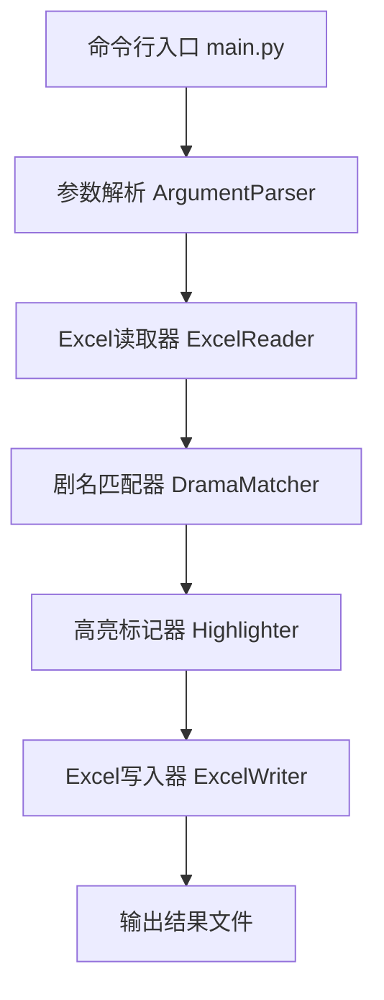

# 设计文档

## 概述

Excel剧名匹配工具是一个Python命令行应用，使用 `openpyxl` 库处理Excel文件。工具接收两个Excel文件路径和各自的剧名列标识作为输入，执行匹配逻辑后输出高亮标记的Excel文件。

技术选型：
- 语言：Python 3.8+
- Excel处理库：openpyxl（支持 .xlsx 格式的读写，保留格式）
- 命令行参数：argparse
- 测试框架：pytest + hypothesis（属性测试）

## 架构



整体采用管道式架构，数据从读取到匹配到标记到输出，单向流动。各组件职责单一，通过函数调用串联。

## 组件与接口

### 1. 命令行入口（main.py）

```python
def main():
    """解析命令行参数，协调各组件完成匹配和标记流程"""
    pass
```

命令行参数：
- `--master`：A文档路径（必填）
- `--lookup`：B文档路径（必填）
- `--master-col`：A文档剧名列标识，支持列名（如"剧名"）或列号（如"2"）（必填）
- `--lookup-col`：B文档剧名列标识，同上（必填）


### 2. Excel读取器（reader.py）

```python
def read_drama_names(file_path: str, column_id: str, sheet_name: str = None) -> list[str]:
    """
    从Excel文件的指定列读取剧名列表。
    
    Args:
        file_path: Excel文件路径
        column_id: 列标识（列名或列号字符串）
        sheet_name: 工作表名称，默认为活动工作表
    
    Returns:
        去除首尾空格后的非空剧名列表
    
    Raises:
        FileNotFoundError: 文件不存在
        ValueError: 文件格式无效或列不存在
    """
    pass

def resolve_column_index(ws, column_id: str) -> int:
    """
    将列标识解析为列索引（1-based）。
    优先按列名匹配第一行表头，若无匹配则尝试解析为数字列号。
    
    Args:
        ws: openpyxl工作表对象
        column_id: 列名或列号字符串
    
    Returns:
        列索引（1-based）
    
    Raises:
        ValueError: 列标识无法解析
    """
    pass
```

### 3. 剧名匹配器（matcher.py）

```python
def match_dramas(master_names: list[tuple[int, str]], lookup_names: set[str]) -> list[int]:
    """
    在主表剧名中查找所有出现在查找列表中的剧名，返回匹配行号。
    
    Args:
        master_names: A文档中的(行号, 剧名)列表
        lookup_names: B文档中的剧名集合（已去除首尾空格）
    
    Returns:
        匹配到的行号列表
    """
    pass
```

匹配策略：将B文档剧名存入 `set` 进行O(1)查找，遍历A文档剧名逐一比对。总时间复杂度O(n+m)，其中n为A文档行数，m为B文档行数。

### 4. 高亮标记器（highlighter.py）

```python
def highlight_rows(ws, matched_rows: list[int], color: str = "FFFF00") -> None:
    """
    将指定行的所有单元格背景色设置为指定颜色。
    
    Args:
        ws: openpyxl工作表对象
        matched_rows: 需要高亮的行号列表（1-based）
        color: 十六进制颜色值，默认黄色
    """
    pass
```

使用 `openpyxl.styles.PatternFill` 设置单元格背景色。通过 `copy()` 方法复制现有样式并仅修改填充色，保留其他格式。

### 5. Excel写入器（writer.py）

```python
def save_workbook(wb, file_path: str) -> None:
    """
    将工作簿保存回原文件路径（覆盖原文件）。
    
    Args:
        wb: openpyxl工作簿对象
        file_path: 原始A文档文件路径
    """
    pass
```

## 数据模型

### 核心数据结构

```python
from dataclasses import dataclass

@dataclass
class MatchResult:
    """匹配结果"""
    matched_rows: list[int]       # 匹配到的行号列表（1-based）
    matched_names: list[str]      # 匹配到的剧名列表
    total_master: int             # A文档总剧名数
    total_lookup: int             # B文档总剧名数
    match_count: int              # 匹配数量
```

### 数据流

1. Excel文件 → `read_drama_names()` → `list[str]`（剧名列表）
2. 剧名列表 → `match_dramas()` → `list[int]`（匹配行号）
3. 匹配行号 → `highlight_rows()` → 修改工作表对象
4. 工作表对象 → `save_workbook()` → 覆盖保存原文件


## 正确性属性

*属性是指在系统所有有效执行中都应成立的特征或行为——本质上是关于系统应该做什么的形式化陈述。属性是人类可读规范与机器可验证正确性保证之间的桥梁。*

### Property 1: 空单元格过滤

*For any* Excel列数据（包含非空字符串和空值/空白字符串的混合列表），读取函数返回的结果列表应仅包含非空字符串，且所有原始非空字符串都应出现在结果中。

**Validates: Requirements 1.5**

### Property 2: 匹配等于集合交集

*For any* A文档剧名列表和B文档剧名集合，匹配结果中的剧名集合应等于两个列表去除首尾空格后的集合交集。

**Validates: Requirements 2.1, 2.2**

### Property 3: 高亮精确性与格式保留

*For any* 工作表和匹配行号集合，高亮操作后：(a) 所有匹配行的单元格背景色为黄色，(b) 所有未匹配行的单元格格式保持不变，(c) 匹配行单元格的非填充格式（字体、边框等）保持不变。

**Validates: Requirements 3.1, 3.2, 3.3**

### Property 4: 保存覆盖原文件

*For any* 输入文件路径，保存操作应将工作簿写回到原始文件路径。

**Validates: Requirements 4.1**

### Property 5: Excel数据往返一致性

*For any* 有效的剧名字符串列表，将其写入Excel文件后再读取回来，应产生与原始列表等价的结果。

**Validates: Requirements 5.3**

## 错误处理

| 错误场景 | 处理方式 | 对应需求 |
|---------|---------|---------|
| 文件路径不存在 | 抛出 `FileNotFoundError`，包含文件路径 | 1.2 |
| 文件格式无效 | 抛出 `ValueError`，提示支持的格式 | 1.3 |
| 列标识不存在 | 抛出 `ValueError`，提示可用的列名列表 | 1.4 |
| 无匹配结果 | 正常完成，输出提示信息，仍生成输出文件 | 2.3 |
| 输出路径已存在 | 直接覆盖原文件（预期行为） | 4.1 |

## 测试策略

### 测试框架

- 单元测试：`pytest`
- 属性测试：`hypothesis`（Python属性测试库）
- 每个属性测试至少运行100次迭代

### 属性测试

每个正确性属性对应一个属性测试，使用 `hypothesis` 生成随机输入：

1. **Property 1 测试**：生成包含随机空值的字符串列表，验证过滤结果
   - Tag: `Feature: excel-drama-matcher, Property 1: 空单元格过滤`
2. **Property 2 测试**：生成随机剧名列表对，验证匹配结果等于集合交集
   - Tag: `Feature: excel-drama-matcher, Property 2: 匹配等于集合交集`
3. **Property 3 测试**：生成随机工作表和行号集合，验证高亮精确性
   - Tag: `Feature: excel-drama-matcher, Property 3: 高亮精确性与格式保留`
4. **Property 4 测试**：验证保存操作写回原文件路径
   - Tag: `Feature: excel-drama-matcher, Property 4: 保存覆盖原文件`
5. **Property 5 测试**：生成随机剧名列表，验证写入后读取的往返一致性
   - Tag: `Feature: excel-drama-matcher, Property 5: Excel数据往返一致性`

### 单元测试

单元测试覆盖具体示例和边界情况：

- 文件不存在时的错误处理
- 无效Excel格式的错误处理
- 列标识不存在的错误处理
- 无匹配结果时的提示输出
- 输出文件覆盖原文件场景
- 空Excel文件处理

### 测试配置

- 属性测试库：`hypothesis`
- 每个属性测试最少100次迭代：`@settings(max_examples=100)`
- 每个属性测试必须注释引用设计文档中的属性编号
